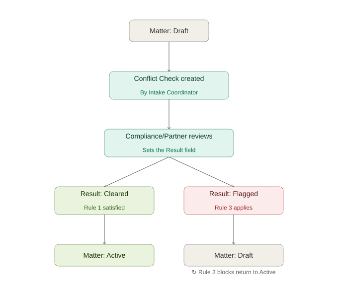

# Conflict Check Enforcement

Part of a two-project Business Analyst portfolio. This project follows [samsara-expansion-analysis](https://github.com/JohnsonDMonica/samsara-expansion-analysis) as the second piece of the arc — moving from a one-time analytical findings report to a requirements-gathering deliverable for a system-enforced business process.

## Business Problem

A legal practice management SaaS platform serving small-to-mid-size law firms needs to ensure every new client matter has a documented, cleared conflict-of-interest check before it can proceed — removing reliance on individual staff diligence.

## Deliverables

- [Business Requirements Document (BRD)](./docs/BRD_ConflictCheck_v1.md) — the business case: situation, problem, objective, scope, stakeholders, success criteria
- [Functional Requirements Document (FRD)](./docs/FRD_ConflictCheck_v1.md) — the technical blueprint: data model, business rules/trigger logic, roles & permissions, user stories
- - [Data Dictionary](./docs/Data_Dictionary_ConflictCheck_v1.md) — plain-language field definitions for a legal-domain audience
- Status-flow diagram (below) — visualizes the Draft → Conflict Check → Active enforcement logic

## Status Flow

## Tools

Requirements written for a Salesforce-style CRM data model (Client, Matter, Conflict Check, Engagement Letter as custom objects). Diagram built to accompany the FRD's business rules.
